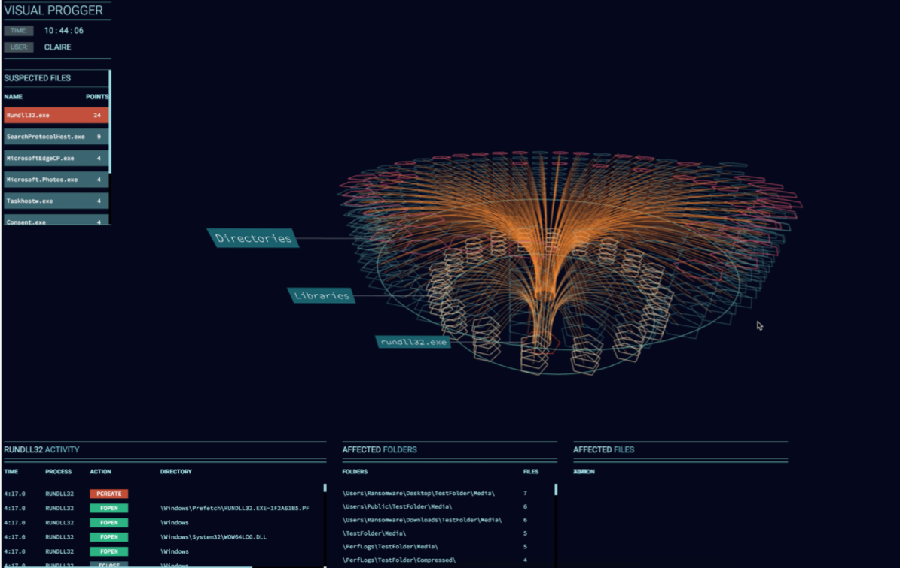
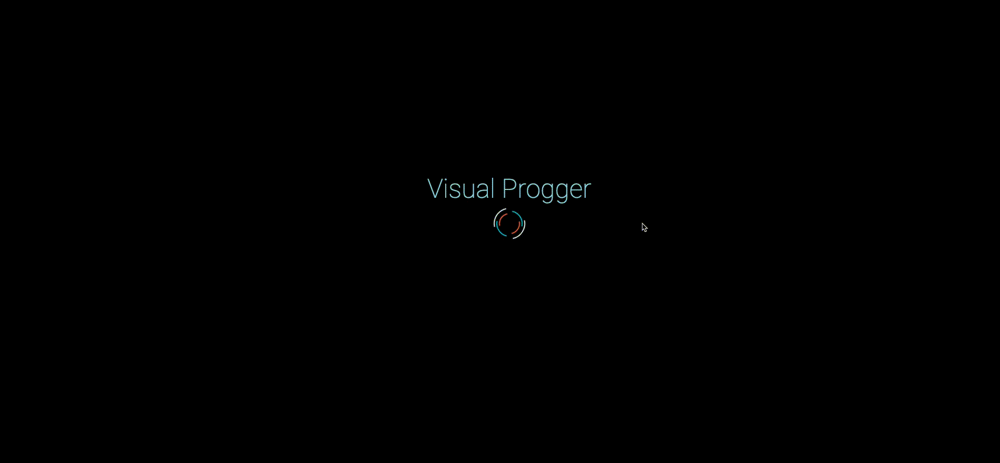
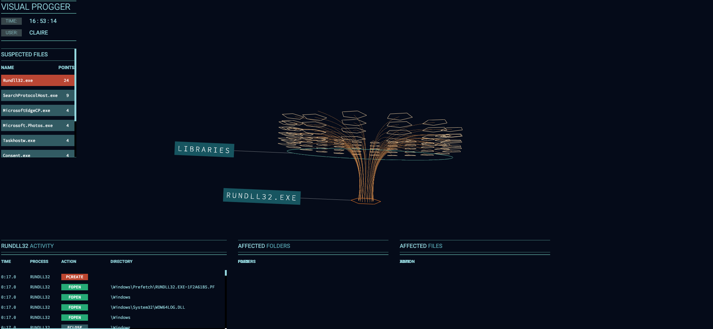
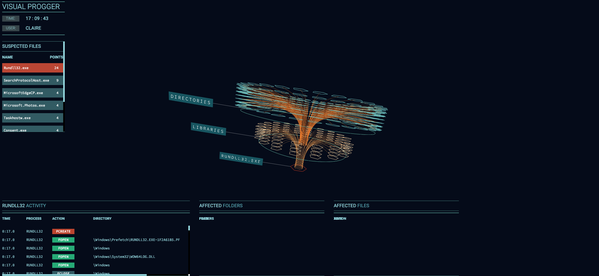
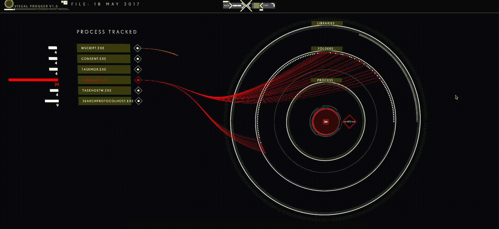

# Visual Progger Project
The project — Visual Progger, was an extension to the cloud based application — Progger, developed in house in the University of Waikato’s CROW research lab.  The cloud based logging application is used primarily for cloud logging to provide details on provenance. 

The project aims to study the patterns and behaviour of malware such as ransomewares on computer users. 

Visual Progger allows you to dive into the activities and patterns of the ransomeware - the type of libraries it utilises, directories and files it traverses to encrypts them.  

The project was to create a visualisation that was intuitive for all users. It also allows meaningful insights to be extracted from the data, such as detecting ransomware in real time.  

Project dated from —  05/05/2017 

## Things to take note
The source code has been modified to provide `presentation only` functionalities. This means that `/live` view will only playback from a previous dataset and not be able to provide realtime visualisation from another host or cloud machine.

## Static Visualistaion
The project consists of two visualisation namely `Static` and `Live` please visit these routes to view them after installation.

### Static Visualisation 
`http://localhost:5000`
<h3 align="center">
  
</h3>

### Live Visualisation | Incomplete
`http://localhost:5000/live`
<h3 align="center">
  
</h3>

## Application Views & Instructions
### Routes
```
http://localhost:5000/
http://localhost:5000/live
```

### Static Visualisation
**Please wait for animation to end before proceeeding to next phase.**  
Press `SPACEBAR` on your keyboard to start.  
<h3 align="center">
  
</h3>

Press `1` to start the first phase of Ransomeware traversing Libraries.
<h3 align="center">
  
</h3>

Press `2` to start the second phase of Ransomeware traversing Files.
<h3 align="center">
  
</h3>

Press `3` to start the third phase of Ransomeware encrypting.
<h3 align="center">
  
</h3>

### Live Visualisation
Just wait to view the magic :).
<h3 align="center">
  
</h3>

## Tech Stack

* [Node.js][node], [NPM][npm], [JavaScript][js], [Babel][babel] — core platform and dev tools
* [Express][express], [cors][cors] etc. — common HTTP-server features
* [MongoDB][mongo] — NoSQL, document, data access and migrations
* [Handlebars][handlebars], [ThreeJS][threejs] — client side technologies.
* [Docker][docker] — Container.
* [Progger][progger] — Logging Provenance for Security.

## Directory Layout
```
├── /app/                       # The folder for source code and application
├── /seed/                      # Seed data to kickstart the visualisation
```

## Getting Started
It is recommended to initialise the project with [Docker][docker]  

Install Docker from [Docker][docker]  
Docker supports macOS, Windows and Ubuntu platforms.

Run the Docker Compose command once docker has been installed.
```
$ docker-compose build
$ docker-compose up -d // detaches
```
Run these commands to clean up and terminate the containers.
```
$ docker-compose down
$ docker system prune
```

## Running without Docker
Ensure you have mongodb installed on your host machine. [Installation of Mongo][mongo-install].

### Starting Server
Run `npm i` in the `/app` directory.
```
cd ./app && npm i
```
Rename `.env.cp` to `.env` from the `/app` Directory. Fill in your custom credentials. i.e PORT=8080, 
```
mv .env.cp .env
```
### Preparing Data
In order to view the visuals of visual progger, the seed data captured from our research will be needed. In short, populate the database with the seed data.   
```
mongorestore -d visualprogger ./seed/dump
```

[isaiah]: https://github.com/isaiahwong
[progger]: https://github.com/CROWLaboratory/Progger
[handlebars]: https://github.com/wycats/handlebars.js/
[pm2]: http://pm2.keymetrics.io/
[node]: https://nodejs.org
[mongo]: https://www.mongodb.com/
[mongo-install]: https://docs.mongodb.com/manual/installation/
[js]: https://developer.mozilla.org/docs/Web/JavaScript
[babel]: http://babeljs.io/
[express]: http://expressjs.com/
[code]: https://code.visualstudio.com/
[docker]: https://www.docker.com/community-edition
[npm]: https://www.npmjs.com/
[hbs]: http://handlebarsjs.com/
[threejs]: https://threejs.org/